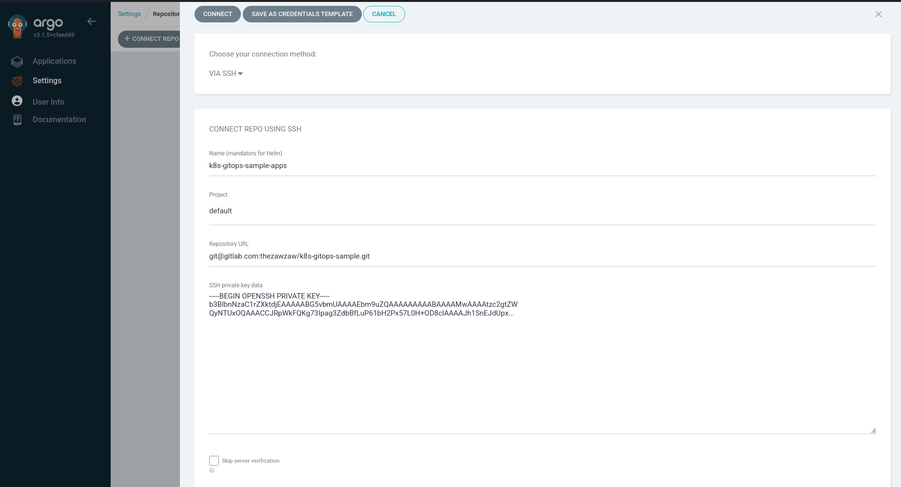
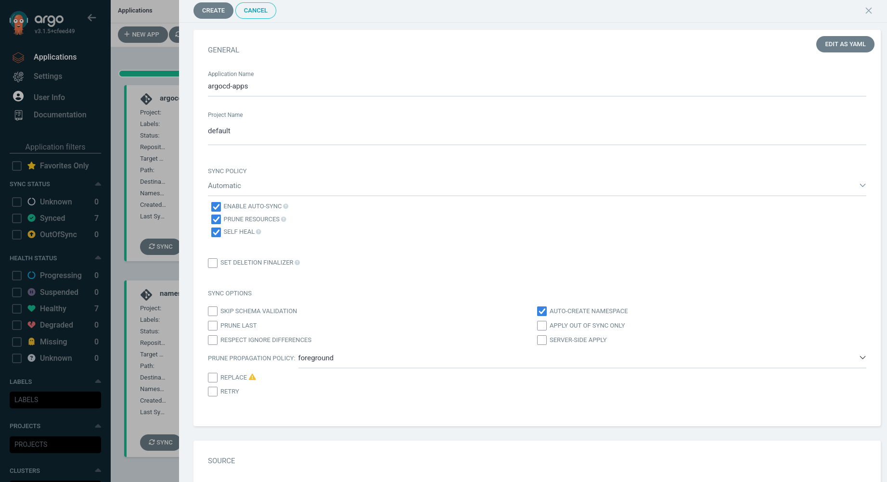

# GitOps in Kubernetes with GitLab CI + Argo CD
## A Hands-on Practical Guide to Building a Fully Automated CI/CD Pipeline Using GitLab CI and GitOps Argo CD on Kubernetes

**PDF Format:** [The PDF version is available here](./pdfs/k8s-gitops-cicd-guide.pdf).


## Introduction

This hands-on practical guide is to demonstrate GitOps CI/CD automation in Kubernetes with GitLab CI and Argo CD using the [podinfo-sample](https://gitlab.com/thezawzaw/podinfo-sample) Python application. It mainly focuses on building end-to-end CI/CD pipeline — how to containerize an application, configure Continuous Integration (CI), Continuous Deployment (CD) and fully automate application deployment on Kubernetes.

## Summary: Objectives

### Tech Stack and Tools

 - **Docker:** For containerizing the application.

 - **GitLab CI:** For Continuous Integration (CI) tool.

 - **Harbor Container Registry:** For storing and hosting the container images.

 - **Kubernetes:** A container orchestration system for managing the containerized applications.

 - **Argo CD:** A GitOps Continuous Delivery (CD) tool for automating app deployments on Kubernetes.

 - **Argo CD Image Updater:** For automatically updating the container image of Argo CD-managed applications.

### What You'll Learn in this Guide

- **Step (1): Containerizing an application**  
  _In this section, you'll learn how to write a [Dockerfile](https://docs.docker.com/reference/dockerfile/) to containerize a sample Python application._

- **Step (2): Building GitLab CI Pipeline**  
  _In this section, you'll learn how to configure a [GitLab CI](https://docs.gitlab.com/ci/) pipeline to build and push Docker container images using Buildah._

- **Step (3): Creating a Kubernetes Cluster**  
  _In this you'll learn how to set up a Kubernetes Cluster with [K3s, Lightweight Kubernetes](https://k3s.io/)._
 
- **Step (4): Writing a Kubernetes Helm Chart from Scratch**  
  _In this section, you'll learn how to write a [Helm Chart](https://helm.sh/) to deploy the Podinfo Python sample application on Kubernetes._

- **Step (5): Configuring GitOps Argo CD on Kubernetes**  
  _In this section, you'll learn how to set up and configure [Argo CD](https://argo-cd.readthedocs.io/en/stable/) as GitOps CD to deploy applications automatically on Kubernetes._

- **Setup (6): Configuring Argo CD Image Updater**  
  _In this section, you'll learn how to set up and configure [Argo CD Image Updater](https://argocd-image-updater.readthedocs.io/en/stable/) to automate updating the Docker container images automatically on Kubernetes._

This hands-on practical guide on GitOps in Kubernetes is based on Poom Wettayakorn's [webapp](https://gitlab.com/gitops-argocd-demo/webapp), but I will share more details and focus on a beginner-friendly guide.

## Before You Begin

Make sure you have installed the following:

- Familiar with basic Linux commands
- Docker Engine
- Linux installed VM or server or local machine (e.g., Ubuntu, Fedora, RHEL, etc.)

## Introduction to GitOps

GitOps is a set of practices fo managing infrastructure and application configurations using the Git repositories as a single source of truth. It's an important part of implementing DevOps practices and building CI/CD pipelines.

GitOps delivers:

 - A standard workflow for app deployments.
 - Improved reliability and visibility with Git version control.
 - Consistency across clusters, cloud, and on-premises environments.

## [1] Containerizing an application

Before you begin, make sure you are familiar with Docker.

 - Install Docker: https://www.docker.com/get-started
 - Dockerfile Reference: https://docs.docker.com/reference/dockerfile

 If you are not familiar with Docker, please learn it first with the following _Docker for Beginners_ tutorial.

 - Docker for Beginners: https://docker-curriculum.com/

### Introduction to a sample app

In this guide, I will use the [podinfo-sample](https://gitlab.com/thezawzaw/podinfo-sample) Python application to demonstrate building a fully automated GitOps CI/CD pipeline in Kubernetes. 

Podinfo is an open-source and simple Python Flask application, originally developed by [Poom Wettayakorn](https://gitlab.com/gitops-argocd-demo/webapp) that shows the following information in UI:

 - **Namespace**
 - **Node Name**
 - **Pod Name**
 - **Pop IP Address**


I've forked Poom Wettayakorn's Podinfo application under my GitLab account and customized it. I will use the following customized version of the Podinfo sample app in this GitOps hands-on practical guide.

Git Repository: [https://gitlab.com/thezawzaw/podinfo-sample](https://gitlab.com/thezawzaw/podinfo-sample)

Fork this Git repository under your GitLab account and clone with the Git command-line tool.

```sh
$ git clone git@gitlab.com:<your-username>/podinfo-sample.git
```

For example, replace `gitops-example` with your username.

```sh
$ git clone git@gitlab.com:gitops-example/podinfo-sample.git
```

### Writing a Dockerfile to containerize the Podinfo app

Firstly, you will need to write Dockerfile to containerize this Python web application. In the [podinfo-sample](https://gitlab.com/thezawzaw/podinfo-sample) Git repository, I've already written a Dockerfile to containerize the app.

Dockerfile Reference: [https://gitlab.com/thezawzaw/podinfo-sample/-/blob/main/Dockerfile](https://gitlab.com/thezawzaw/podinfo-sample/-/blob/main/Dockerfile)

```Dockerfile
#
# Stage (1): Builder Stage
#
# Install the app source code and required Python packages.
#
FROM python:3.12-alpine AS builder

ENV APP_WORKDIR=/app
ENV PATH="${APP_WORKDIR}/venv/bin:$PATH"

WORKDIR ${APP_WORKDIR}

COPY . .

RUN apk add --no-cache \
    gcc musl-dev && \
    python -m venv venv && \
    pip install --upgrade pip && \
    pip install -r requirements.txt

#
# Stage (2): Runtime Stage
#
# The final runtime environment for serving the Podinfo sample application.
#
FROM python:3.12-alpine AS runtime

ENV FLASK_APP=run.py
ENV APP_WORKDIR=/app
ENV APP_USER=zawzaw
ENV APP_GROUP=zawzaw
ENV APP_PORT=5005
ENV PATH="${APP_WORKDIR}/venv/bin:$PATH"

RUN adduser -D ${APP_USER}

WORKDIR ${APP_WORKDIR}

RUN pip uninstall pip -y
COPY --from=builder --chown=${APP_USER}:${APP_GROUP} ${APP_WORKDIR} ${APP_WORKDIR}

USER ${APP_USER}

EXPOSE ${APP_PORT}

ENTRYPOINT ["gunicorn", "--config", "gunicorn-cfg.py", "run:app"]
```

**_Explanation:_**

In the Stage (1) — Builder Stage:

- Create an application workdir.
- Add the application source code, create the Python virtual environment (venv) and install required packages with pip.

In the Stage (2) — Runtime Stage:

- Copy the created Python venv from the builder stage.
- Then, create and switch to a normal user and serve the Podinfo Python application with the Gunicorn server.

### Building and Testing the Container Image Locally

To build the Docker image locally, run the following `docker build` command:

```
$ cd podinfo-sample
$ docker build -t podinfo-sample:local .
```
C
To run and test the Podinfo application locally with `docker run`:

```
$ docker run -p 5005:5005 -it --rm --name podinfo podinfo-sample:local
```

To test the Podinfo application locally, open the following localhost address in the web browser:

URL: [http://localhost:5005](http://localhost:5005)


---

## [2] Building a GitLab CI Pipeline

### Introduction to GitLab CI

 - **GitLab CI** is a Continuous Integration (CI) that automates building and testing the code changes via a `.gitlab-ci.yml` file on your GitLab repository. *For Example,* in this GitOps CI/CD guide, I will use GitLab CI to build the container image of the Podinfo Python application automatically.

 - **GitLab Runner** is an application or server that runs GitLab CI jobs in a pipeline. GitLab CI jobs are defined and configured in the `.gitlab-ci.yml` file that automatically triggers when you push the code changes to GitLab. Then, GitLab Runner runs these CI jobs on the server or computing infrastructure. For more information about GitLab Runner, please see [https://docs.gitlab.com/runner/#what-gitlab-runner-does](https://docs.gitlab.com/runner/#what-gitlab-runner-does).

Before you begin, make sure you have learned the basics of GitLab CI and YAML syntax. Please, start with the following tutorials.

 - Get started with GitLab CI: https://docs.gitlab.com/ci/
 - CI/CD YAML Syntax Reference: https://docs.gitlab.com/ci/yaml/

### Installing and Registering a GitLab Runner (Optional)

> [!NOTE]
>
> In this guide, I will use a self-managed GitLab Runner for running GitLab CI jobs for full control, but it's OPTIONAL.
>
> You can also use GitLab-hosted Runners. Please see [https://docs.gitlab.com/ci/runners/hosted_runners/linux/](https://docs.gitlab.com/ci/runners/hosted_runners/linux/). These Runners are managed and hosted by GitLab. You can use these GitLab Runners without installing and registering your own GitLab Runners.
>
> If you want to use GitLab-hosted Runners, you can skip this step.

GitLab provides the GitLab Runner packages for most Linux distributions. But, installation depends on your Linux distribution. In this guide, I will focus on RHEL-based Linux systems.

Add the following GitLab RPM repository (e.g., Fedora Linux):

```sh
$ curl -L "https://packages.gitlab.com/install/repositories/runner/gitlab-runner/script.rpm.sh" | sudo bash
```

Install the GitLab Runner with `yum` or `dnf`:

```sh
$ sudo yum install gitlab-runner
```

(OR)

```sh
$ sudo dnf install gitlab-runner
```

For any other Linux distributions, please see [https://docs.gitlab.com/runner/install/linux-repository/](https://docs.gitlab.com/runner/install/linux-repository/).

After you install a GitLab Runner, you need to register this for your Podinfo Git repository. Firstly, you need to fork the Podinfo sample application repository that I've mentioned previously. *(If you have already forked, you don't need to fork again.)*

**Podinfo Sample Git Repository:** https://gitlab.com/thezawzaw/podinfo-sample

Go to your Podinfo Git repository >> <kbd>Settings</kbd> >> <kbd>CI/CD</kbd> >> <kbd>Runners</kbd> >> <kbd>Three dots menu</kbd> and then copy your <kbd>Registration token</kbd>. *(Note: Registration tokens are deprecated, but you can still use them.)*

And then, register with the GitLab URL and registration token. Replace with your actual registration token.

```sh
$ sudo gitlab-runner register --url https://gitlab.com/ --registration-token <example-token-here>
```

And then, you also need to set the `executor`, `docker-image`, and `description` in the *interactive* shell mode.

(OR)

Alternatively, you can register a GitLab Runner in the *non-interactive* shell mode.

```sh
sudo gitlab-runner register \
  --non-interactive \
  --url "https://gitlab.com/" \
  --token <your-registration-token> \
  --executor "docker" \
  --docker-image alpine:latest \
  --description "GitLab Runner for the Podinfo application"
```

And then, you can check GitLab Runner `config.toml` configuration in the `/etc/gitlab-runner/config.toml` file.

```sh
$ cat /etc/gitlab-runner/config.toml
```

Output:

```toml
concurrent = 8
check_interval = 0
connection_max_age = "15m0s"
shutdown_timeout = 0

[session_server]
  session_timeout = 1800

[[runners]]
  name = "Podinfo GitLab Runner on Fedora Linux"
  url = "https://gitlab.com/"
  id = 50528940
  token = "<registration-token-example>" # Replace with your registration token.
  token_obtained_at = 2025-11-13T06:27:20Z
  token_expires_at = 0001-01-01T00:00:00Z
  executor = "docker"
  [runners.cache]
    MaxUploadedArchiveSize = 0
    [runners.cache.s3]
    [runners.cache.gcs]
    [runners.cache.azure]
  [runners.docker]
    image = "alpine:latest"
    privileged = false
    tls_verify = false
    pull_policy = "if-not-present"
    disable_entrypoint_overwrite = false
    oom_kill_disable = false
    disable_cache = false
    shm_size = 0
    network_mtu = 0
    volumes = ["/cache"]
```

### Configuring a GitLab CI Pipeline to Build and Push Container Images

> [!NOTE]
> 
> In this guide, I will use the private **Harbor Container Registry** for storing and hosting the Docker container image of the Podinfo application.
>
> For container registry, you can use any other public container registry server. For example, Docker Hub or GHCR or Quay.io.

In this section, I will use Buildah to build and push Docker container images automatically to the Harbor Docker registry.

[Buildah](https://github.com/containers/buildah) is a tool that facilitates building [Open Container Initiative (OCI)](https://www.opencontainers.org/) Container images. Buildah is designed to run in **Userspace**, also known as **Rootless mode** and does not require a root-privileged daemon like traditional Docker daemon. This is one of its primary advantages, especially in secured and automated CI/CD environments. Please, see the following GitHub wiki page.

**Building Container Images with Buildah in GitLab CI:** https://github.com/thezawzaw/platform-wiki/wiki/Building-Container-Images-with-Buildah-in-GitLab-CI

Before you configure a GitLab CI pipeline, make sure you add two GitLab CI variables `REGISTRY_HOST` `DOCKER_CFG` on the Podinfo Git repository. You also need to get your container registry credentials.

To get your container registry credentials with the following steps:

- Log in to the container registry server with username and password.

   *For Example,*
   
   ```sh
   $ expose REGISTRY_PASSWORD=examplePasswd
   $ docker login --username zawzaw --password ${REGISTRY_PASSWORD} harbor-repo-example.io
   ```

- Then, your container registry credentials are stored in the `~/.docker/config.json` file.

   ```sh
   [zawzaw@fedora-linux:~]$ cat ~/.docker/config.json 
   {
           "auths": {
                   "harbor-repo-example.io": {
                           "auth": "emF3emF3Okhhcm..."
                   }
           }
   }
   ```

Then, go to your Podinfo Git repository >> <kbd>Project Settings</kbd> >> <kbd>CI/CD</kbd> >> <kbd>Variables</kbd>, and add the following key/value GitLab CI variables.

> [!NOTE]
>
> Replace with your Container registry credentials.
>
> - Key: `REGISTRY_HOST`, Value: `<your-registry-host>`
> - Key: `DOCKER_CFG`, Value: `<your-registry-auth-creds>`

*For Example,*

| Key | Value |
| --- | --- |
| `REGISTRY_HOST` | `harbor-repo-example.io` |
| `DOCKER_CFG` | `{"auths": {"harbor-repo-example.io": {"auth": "emF3emF3Okhhcm..."}}}` |

`REGISTRY_HOST`: for your Container registry host.

`DOCKER_CFG`: for the credentials to access your Container registry server. You can find your Docker login credentials in the `~/.docker/config.json` file of the host machine.

I've already created `.gitlab-ci.yml` GitLab CI configuration on the Podinfo Git repository. But, you can write your own `.gitlab-ci.yml` configuration under your Podinfo sample project's root directory.

GitLab CI Configuration [https://gitlab.com/thezawzaw/podinfo-sample/-/blob/main/.gitlab-ci.yml](https://gitlab.com/thezawzaw/podinfo-sample/-/blob/main/.gitlab-ci.yml)

```yaml
#
# GitLab CI Configuration
#

#
# Define the CI stages here.
#
stages:
  - build

# Define global variables here.
variables:
  IMAGE_REPO: "${REGISTRY_HOST}/library/${CI_PROJECT_NAME}"

###################################################################################
#                                                                                 #
# GitLab CI Templates                                                             #
#                                                                                 #
###################################################################################

# Template ---> template_build
# to build and push the Docker container images to the Container Registry server.
.template_build: &template_build
  stage: build
  image: quay.io/buildah/stable
  variables:
    BUILDAH_FORMAT: docker
    TARGET_IMAGE_TAG: ""
  script:
    - echo ${DOCKER_CFG} > /home/build/config.json
    - export REGISTRY_AUTH_FILE=/home/build/config.json
    - echo "Building Docker container image [ $IMAGE_REPO:$TARGET_IMAGE_TAG ]..."
    - >-
      buildah build
      --file ${CI_PROJECT_DIR}/Dockerfile
      --layers
      --cache-to ${IMAGE_REPO}/cache
      --cache-from ${IMAGE_REPO}/cache
      --tls-verify=false
      --tag ${IMAGE_REPO}:${TARGET_IMAGE_TAG} .
    - buildah push --tls-verify=false ${IMAGE_REPO}:${TARGET_IMAGE_TAG}
    - buildah rmi -f ${IMAGE_REPO}:${TARGET_IMAGE_TAG}

##########################################################################################
#                                                                                        #
# GitLab CI Jobs                                                                         #
#                                                                                        #
##########################################################################################

#
# Build CI Job ---> build-image-dev
# to build the Docker container image with the Git branch name as image tag name when you push changes into the 'develop' branch.
#
build-image-dev:
  <<: *template_build
  variables:
    TARGET_IMAGE_TAG: "${CI_COMMIT_REF_SLUG}"
  rules:
    - if: '$CI_COMMIT_BRANCH == "develop"'

#
# Build CI Job ---> build-image-main
# to build the Docker container image with latest image tag name when you push changes into the 'main' branch.
#
build-image-main:
  <<: *template_build
  variables:
    TARGET_IMAGE_TAG: "latest"
  rules:
    - if: '$CI_COMMIT_BRANCH == "main"'

#
# Build CI Job ---> build-image-tag
# to build the Docker container image with the Git tag name as image tag when you create a Git tag.
#
build-image-tag:
  <<: *template_build
  variables:
    TARGET_IMAGE_TAG: "${CI_COMMIT_TAG}"
  rules:
    - if: "$CI_COMMIT_TAG"
```

**_Explanation:_**

When you push some changes into the Podinfo Git repository, GitLab CI builds the Docker container image of the Podinfo application using [Buildah](https://github.com/containers/buildah) and then, pushes the image to your Container registry server.

Container image name format ⟶  `<your-container-registry>/library/podinfo-sample:<image-tag-name>`

 - When you push changes into the `develop` branch, the `<image-tag-name>` will be `develop`.
 - When you push changes into the `master` branch, the `<image-tag-name>` will be `latest`.
 - When you create a Git tag on the Git repository, the `<image-tag-name>` will be the Git tag number you created.

*For Example,*

When I push some changes into the `master` branch, the container image name is `harbor-repo-example.io/library/podinfo-sample:latest`. You can also see the logs in the GitLab CI build job's logs. For reference, please see [https://gitlab.com/thezawzaw/podinfo-sample/-/jobs/12120436761](https://gitlab.com/thezawzaw/podinfo-sample/-/jobs/12120436761)

```
[2/2] COMMIT harbor-repo-example.io/library/podinfo-sample:latest
--> Pushing cache [harbor-repo-example.io/library/podinfo-sample/cache]:23c4fe872d978253fd66b2a50aa2d6e40da8a09c9f5fd79910fdf7855fc88d7a
--> 048e6533805b
Successfully tagged harbor-repo-example.io/library/podinfo-sample:latest
048e6533805b842328e03e7b1b9b2b5efdf2bce11d706283690a8dde4afc78d3
...
```

---

## [3] Creating a Kubernetes Cluster with K3s

> [!NOTE]
>
> If you already have a Kubernetes cluster on your local machine or server, you can skip this step.

In this section, you will learn how to set up a Kubernetes cluster with K3s. I will use K3s in this guide, but you can also use any other Kubernetes distribution.

[K3s](https://k3s.io/) is a small, minimal, and lightweight Kubernetes distribution, developed and maintained by Rancher. K3s is easy to install, half the memory, all in a single binary of less than 100MB that reduces the dependencies and steps needed to install, run and auto-update a production Kubernetes cluster.

The K3s Official Documentation: [https://docs.k3s.io/](https://docs.k3s.io/)

### Set up K3s Kubernetes Cluster

To bootstrap and set up a K3s Kubernetes cluster, run the following script:

```sh
#!/usr/bin/env bash

#
# A Shell Script
# to setup and bootstrap the K3s server, also known as Kubernetes control-plane/master node
#
# This script is for setup the single-node K3s Kubernetes cluster.
#

curl -sfL https://get.k3s.io | sh -s - server --write-kubeconfig-mode 644
```

This installation script is for bootstrapping and creating the single-node K3s Kubernetes cluster with proper permissions to the default kubeconfig file. You can also learn how to install on the K8s quickstart guide: [https://docs.k3s.io/quick-start](https://docs.k3s.io/quick-start)

Then, you can check your K3s Kubernetes cluster by running the `kubectl get node` command:

```sh
$ kubectl get node -o wide
```

Output:

```sh
AME                    STATUS   ROLES                  AGE   VERSION        INTERNAL-IP    EXTERNAL-IP   OS-IMAGE                      KERNEL-VERSION                 CONTAINER-RUNTIME
airnav-dev-k3s-server   Ready    control-plane,master   22h   v1.33.4+k3s1   192.168.x.x   <none>        AlmaLinux 9.6 (Sage Margay)   5.14.0-570.41.1.el9_6.x86_64   containerd://2.0.5-k3s2
```

### Installing the Dashboard UI to manage Kubernetes Clusters

By default, K3s has built-in [kubectl](https://kubernetes.io/docs/reference/kubectl/), which is a client command-line tool mainly used to manage and communicate with the Kubernetes clusters. You can use both the *kubectl* command-line tool and the UI dashboard to manage your Kubernetes clusters.

For a UI dashboard to manage your Kubernetes clusters, I recommend you use Freelens Kubernetes IDE (or) the official Kubernetes Dashboard application.

#### Freelens Kubernetes IDE


In this guide, I will use Freelens, a Kubernetes IDE, to manage the K3s Kubernetes cluster.

Freelens is a free and open-source Kubernetes IDE that provides a graphical user interface (UI) for managing and monitoring Kubernetes clusters. Freelens is currently maintained by the community.

 - GitHub Repository: [https://github.com/freelensapp/freelens](https://github.com/freelensapp/freelens)
 - The Official Website: [https://freelensapp.github.io/](https://freelensapp.github.io/)

Download the Freelens package with curl, for example, RPM-based Linux systems,

```sh
curl -LO https://github.com/freelensapp/freelens/releases/download/v1.7.0/Freelens-1.7.0-linux-amd64.rpm
```

Install the Freelens, for example, RPM-based Linux systems,

```sh
sudo dnf install ./Freelens-1.7.0-linux-amd64.rpm
```

For more option on installing the Freelens package, please see on GitHub: [https://github.com/freelensapp/freelens/blob/main/README.md#downloads](https://github.com/freelensapp/freelens/blob/main/README.md#downloads)

(OR)

#### Kubernetes Dashboard


You can also use the official Kubernetes Dashboard. It is a general-purpose and web-based UI that allows users to manage the Kubernetes clusters and containerized applications running in the cluster and troubleshoot them.

 - GitHub Repository: [https://github.com/kubernetes/dashboard](https://github.com/kubernetes/dashboard)
 - Kubernetes Documentation: [https://kubernetes.io/docs/tasks/access-application-cluster/web-ui-dashboard/](https://kubernetes.io/docs/tasks/access-application-cluster/web-ui-dashboard/)

Please, see the detailed documentation on how to install Kubernetes Dashboard: [https://github.com/kubernetes/dashboard/blob/master/README.md#installation](https://github.com/kubernetes/dashboard/blob/master/README.md#installation)

---

## [4] Writing a Kubernetes Helm Chart from Scratch

Before you write a Kubernetes Helm chart for the Podinfo sample application, make sure you understand **Kubernetes core components**, **Kubernete objects** and **workloads resources** first. If you are not familiar with Kubernetes, you can start with the [Kubernetes Basics](https://kubernetes.io/docs/tutorials/kubernetes-basics) tutorial.

Useful tutorials and guides to learn Kubernetes:

- Learn Kubernetes Basics: [https://kubernetes.io/docs/tutorials/kubernetes-basics](https://kubernetes.io/docs/tutorials/kubernetes-basics/)
- Kubernetes Core Concepts and Components: [https://kubernetes.io/docs/concepts/](https://kubernetes.io/docs/concepts/)

> [!NOTE]
>
> If you have experience in writing and building the Helm Chart, you can skip this section.

In this section, I will write a Kubernetes Helm chart from scratch for the Podinfo Python application. I had published an article, and you can also learn about how to write a Kubernetes Helm chart from scratch with this article.

**Writing a Kubernetes Helm Chart from Scratch:** [https://www.zawzaw.blog/k8s-write-k8s-helm-chart/](https://www.zawzaw.blog/k8s-write-k8s-helm-chart/)

For reference, I've already written a Helm chart for the Podinfo Python application. Please, see the **Podinfo Helm Chart** on the following GitOps repository.

**Podinfo Helm Chart:** [https://gitlab.com/thezawzaw/k8s-gitops-airnav-sample/-/tree/main/helm/podinfo-app](https://gitlab.com/thezawzaw/k8s-gitops-airnav-sample/-/tree/main/helm/podinfo-app)

### Introduction to Helm

**Helm** is a Kubernetes package manager CLI tool that manages and deploys Helm charts.

**Helm Charts** are collection and packages of pre-configured application ressources which can be deployed as one unit. Helm charts help you define, install, upgrade and deploy applications easily on Kubernetes cluster.

 - The Offical Website: [https://helm.sh/](https://helm.sh/)
 - Helm Charts: [https://artifacthub.io/](https://artifacthub.io/)

### Installation and Setup

To install the Helm command-line tool with script, run the following command:

```sh
$ curl -fsSL -o get_helm.sh https://raw.githubusercontent.com/helm/helm/main/scripts/get-helm-4
```

```sh
$ chmod 700 get_helm.sh && ./get_helm.sh
```

(OR)

You can install the Helm command-line tool with any other package managers. Please, see on the Helm documentation: [https://helm.sh/docs/intro/install#through-package-managers](https://helm.sh/docs/intro/install#through-package-managers).

### Understanding application concepts

Before you write a Helm chart for your Podinfo application, make sure you understand the application's concept and how the application works.

In the Podinfo Python application, it will display the following information in the UI:

 - **Namespace**
 - **Node Name**
 - **Pod Name**
 - **Pop IP Address**

For example,


Basically, the Podinfo Python application retrieves the data or information dynamically via the Kubernetes environment variables. So, you need to expose the Pod and Node information to the container via the environment variables in Kubernetes. Then, the app uses these environment variables to retrieve information dynamically.

Reference: [Expose Pod Information to Containers Through Environment Variables](https://kubernetes.io/docs/tasks/inject-data-application/environment-variable-expose-pod-information)

For example, you can set these `ENV` variables with key/value form in your Kubernetes deployment like this:

```yaml
env:
  - name: NODE_NAME
    valueFrom:
      fieldRef:
        fieldPath: spec.nodeName
- name: NAMESPACE
    valueFrom:
      fieldRef:
        fieldPath: metadata.namespace
  - name: POD_NAME
    valueFrom:
      fieldRef:
        fieldPath: metadata.name
  - name: POD_IP
    valueFrom:
      fieldRef:
        fieldPath: status.podIP
```

It's key/value form like this:

 - `NODE_NAME`=`spec.nodeName`
 - `NAMESPCE`=`metadata.namespace`
 - `POD_NAME`=`metadata.name`
 - `POD_IP`=`status.podIP`

### Creating a Helm Chart with Helm CLI

Create a Helm chart with the Helm command-line tool:

```sh
$ cd ~/helm/
$ helm create podinfo-app
```

Then, Helm automatically generates and bootstraps the Helm templates and values like this:

```sh
[zawzaw@fedora-linux:~/helm/podinfo-app]$ tree
.
├── Chart.yaml
├── README.md
├── templates
│   ├── deployment.yaml
│   ├── _helpers.tpl
│   ├── hpa.yaml
│   ├── httproute.yaml
│   ├── ingress.yaml
│   ├── NOTES.txt
│   ├── serviceaccount.yaml
│   ├── service.yaml
│   └── tests
│       └── test-connection.yaml
└── values.yaml

3 directories, 12 files
```

### Customizing and Configuring Helm Chart

Basically, Helm Charts have main three categories:

 - `Chart.yaml`
   - Define Helm chart name, description, chart revision and so on.

 - `templates/`
   - Helm templates are general and dynamic configurations that locate Kubernetes resources
   written in YAML-based [Helm template language](https://helm.sh/docs/chart_template_guide).
   It means that we can pass variables from `values.yaml` file into templates files when we deploy Helm chart.
   So, values can be changed dynamically based on you configured Helm templates at deployment time.

 - `values.yaml`
   - Declare variables to be passed into Helm templates. So, when we run `helm install` to deploy Helm charts,
   Helm sets this variables into Helm templates files based on you configured templates and values.

In the other words, Helm charts are pre-configured configurations and packages as one unit to deploy applications esaily on Kubernetes cluster.

After initialize a new Helm chart, we need to customize Helm templates and values as you need. It depends on your web application.
For the Podinfo Helm Chart, we need to configure the following steps.

---

#### Set Docker container image

_**Values Path ▸ {HELM_CHART_ROOT}/values.yaml**_

In the `values.yaml` file, define variables for the Docker container image that we've built and pushed to your container registry.

```yaml
image:
  repository: harbor-repo-example.io/library/podinfo-sample:latest
  pullPolicy: IfNotPresent
  tag: "latest"
```

</br>

_**Deployment Template Path ▸ {HELM_CHART_ROOT}/templates/deployment.yaml**_

In the `templates/deployment.yaml` file, we can set variables from values.yaml with `.Values.image.repository`, `.Values.image.pullPolicay` and `.Values.image.tag`. It's YAML-based Helm template language syntax. You can learn on [The Chart Template Developer's Guide](https://helm.sh/docs/chart_template_guide).

  - Get Docker image repository: `.Values.image.repository`
  - Get Docker image pull policy: `.Values.image.pullPolicy`
  - Get Docker image tag: `.Values.image.tag`

So, when need to get variables form `values.yaml` file, we can use `.Values` in Helm templates like this:

```yaml
containers:
  - name: {{ .Chart.Name }}
    image: "{{ .Values.image.repository }}:{{ .Values.image.tag | default .Chart.AppVersion }}"
    imagePullPolicy: {{ .Values.image.pullPolicy }}
```

---

#### Set Docker Image Pull Secret
##### Optional: For Only Private Container Registry

> [!NOTE]
>
> This is only needed when you are using the private container registry server. If you are using the Docker container image on the public container registry (e.g., Docker Hub), you don't need to set the image pull secret.
>
> Reference: [https://kubernetes.io/docs/tasks/configure-pod-container/pull-image-private-registry/](https://kubernetes.io/docs/tasks/configure-pod-container/pull-image-private-registry/)

Log in to the container registry server with username and password.

*For Example,*

```sh
$ expose REGISTRY_PASSWORD=examplePasswd
$ docker login --username zawzaw --password ${REGISTRY_PASSWORD} harbor-repo-example.io
```

Then, your container registry credentials are stored in the `~/.docker/config.json` file.

```sh
[zawzaw@fedora-linux:~]$ cat ~/.docker/config.json 
{
        "auths": {
                "harbor-repo-example.io": {
                        "auth": "emF3em..."
                }
        }
}
```

Then, create a Docker image pull secret with the `kubectl` command-line tool.

> [!NOTE]
>
> If you deploy the Podinfo Helm Chart in the `dev` namespace, your Docker image pull secret must be in the same namespace.

```sh
$ kubectl create secret generic secret-registry-harbor \
 --from-file=.dockerconfigjson=/home/zawzaw/.docker/config.json \
 --type=kubernetes.io/dockerconfigjson \
 --namespace dev
```

Then, you can see now your Docker image pull secret by running the `kubectl get secrets` command.
```sh
$ kubectl get secrets secret-registry-harbor --namespace dev -o yaml
```
```yaml
apiVersion: v1
kind: Secret
metadata:
  name: secret-registry-harbor
  namespace: dev
  ...
type: kubernetes.io/dockerconfigjson
data:
  .dockerconfigjson: ewoJImF1dGhzIjogewoJCSJoYXJib3ItZGV2LXJlcG8ub3BzLmlvIjogewoJCQkiYXV0aCI6ICJlbUYzZW1GM09pUmhaa3R5UFRwbGNFZ3pXallw...
```

</br>

_**Values Path ▸ {HELM_CHART_ROOT}/values.yaml**_

Then, set the Docker image pull secret you created in the above step in the `values.yaml` file.

```yaml
# This is for the secrets for pulling an image from a private repository more information can be found here: https://kubernetes.io/docs/tasks/configure-pod-container/pull-image-private-registry/
imagePullSecrets:
  - name: secret-registry-harbor
...
```

---

#### Set Service Port and Target Port

_**Values Path ▸ {HELM_CHART_ROOT}/values.yaml**_

In the `values.yaml` file, define variables for sevice type, port and targetPort.

  ```yaml
  service:
    type: NodePort
    port: 80
    targetPort: http
  ```

</br>

_**Service Template Path ▸ {HELM_CHART_ROOT}/templates/service.yaml**_

In `templates/service.yaml` file, we can set service varibales from values.yaml file like this:
  
  - Get service type: `.Values.service.type`
  - Get service port: `.Values.service.port`
  - Get service target port: `.Values.service.targetPort`

```yaml
spec:
  type: {{ .Values.service.type }}
  ports:
    - port: {{ .Values.service.port }}
      targetPort: {{ .Values.service.targetPort }}
      protocol: TCP
      name: http
```

---

#### Set Target Docker Container Port

_**Values Path ▸ {HELM_CHART_ROOT}/values.yaml**_

In the `values.yaml` file, define a variable for the Container port number that the Podinfo app is serving and listening to.

```yaml
deployment:
  containerPort: 5005
```

</br>

_**Deployment Template Path ▸ {HELM_CHART_ROOT}/templates/deployment.yaml**_

In the `templates/deployment.yaml` file, set target Docker container port variable from values.yaml file:

Get target container port: `.Values.deployment.containerPort`

```yaml
containers:
 - name: {{ .Chart.Name }}
   ports:
    - name: http
      containerPort: {{ .Values.deployment.containerPort }}
      protocol: TCP
```

---

#### Set Environment Varibales

_**Values Path ▸ {HELM_CHART_ROOT}/values.yaml**_

In the `values.yaml` file, define environment variables that the Podinfo application retrieves the data in UI.

```yaml
deployment:
  env:
    - name: NODE_NAME
      valueFrom:
        fieldRef:
          fieldPath: spec.nodeName
    - name: NAMESPACE
      valueFrom:
        fieldRef:
          fieldPath: metadata.namespace
    - name: POD_NAME
      valueFrom:
        fieldRef:
          fieldPath: metadata.name
    - name: POD_IP
      valueFrom:
        fieldRef:
          fieldPath: status.podIP
```

</br>

_**Deployment Template Path ▸ {HELM_CHART_ROOT}/templates/deployment.yaml**_

In `templates/deployment.yaml`, set environment variables dynamically from the values.yaml file. When you need to pass the array and whole config block into Helm templates, you can use `- with` and `- toYaml`.

```yaml
containers:
  - name: {{ .Chart.Name }}
    {{- with .Values.deployment.env }}
     env:
       {{- toYaml . | nindent 12 }}
    {{- end }}
```

---

### Debugging Helm Templates

After you build a Helm Chart for the Podinfo application, we can debug and test Helm templates locally with the `helm template` command.

The `helm template` command renders the Helm Chart templates and shows the output locally.

*Format:*

```sh
$ helm template <helm_release_name> <helm_chart_path> --values <values_file_path> --namespace <your_namespace>
```

*For Example:*

```sh
$ cd helm/podinfo-app
$ helm template podinfo-app-dev ./ --values values.yaml --namespace dev
```

If you have syntax errors, Helm shows error messages.

This is automatically generated and rendered by the Helm command-line tool based on your configured Helm templates and values.

```yaml
---
# Source: podinfo-app/templates/serviceaccount.yaml
apiVersion: v1
kind: ServiceAccount
metadata:
  name: podinfo-app-dev
  labels:
    helm.sh/chart: podinfo-app-0.1.0
    app.kubernetes.io/name: podinfo-app
    app.kubernetes.io/instance: podinfo-app-dev
    app.kubernetes.io/version: "1.16.0"
    app.kubernetes.io/managed-by: Helm
automountServiceAccountToken: true
---
# Source: podinfo-app/templates/service.yaml
apiVersion: v1
kind: Service
metadata:
  name: podinfo-app-dev
  labels:
    helm.sh/chart: podinfo-app-0.1.0
    app.kubernetes.io/name: podinfo-app
    app.kubernetes.io/instance: podinfo-app-dev
    app.kubernetes.io/version: "1.16.0"
    app.kubernetes.io/managed-by: Helm
spec:
  type: NodePort
  ports:
    - port: 80
      targetPort: 5005
      protocol: TCP
      name: http
  selector:
    app.kubernetes.io/name: podinfo-app
    app.kubernetes.io/instance: podinfo-app-dev
---
# Source: podinfo-app/templates/deployment.yaml
apiVersion: apps/v1
kind: Deployment
metadata:
  name: podinfo-app-dev
  labels:
    helm.sh/chart: podinfo-app-0.1.0
    app.kubernetes.io/name: podinfo-app
    app.kubernetes.io/instance: podinfo-app-dev
    app.kubernetes.io/version: "1.16.0"
    app.kubernetes.io/managed-by: Helm
spec:
  replicas: 1
  selector:
    matchLabels:
      app.kubernetes.io/name: podinfo-app
      app.kubernetes.io/instance: podinfo-app-dev
  template:
    metadata:
      labels:
        helm.sh/chart: podinfo-app-0.1.0
        app.kubernetes.io/name: podinfo-app
        app.kubernetes.io/instance: podinfo-app-dev
        app.kubernetes.io/version: "1.16.0"
        app.kubernetes.io/managed-by: Helm
    spec:
      imagePullSecrets:
        - name: secret-registry-harbor
      serviceAccountName: podinfo-app-dev
      containers:
        - name: podinfo-app
          image: "harbor-repo-example.io/library/podinfo-sample:develop"
          imagePullPolicy: Always
          ports:
            - name: http
              containerPort: 5005
              protocol: TCP
          env:
            - name: NODE_NAME
              valueFrom:
                fieldRef:
                  fieldPath: spec.nodeName
            - name: NAMESPACE
              valueFrom:
                fieldRef:
                  fieldPath: metadata.namespace
            - name: POD_NAME
              valueFrom:
                fieldRef:
                  fieldPath: metadata.name
            - name: POD_IP
              valueFrom:
                fieldRef:
                  fieldPath: status.podIP
          livenessProbe:
            httpGet:
              path: /
              port: http
          readinessProbe:
            httpGet:
              path: /
              port: http
---
# Source: podinfo-app/templates/tests/test-connection.yaml
apiVersion: v1
kind: Pod
metadata:
  name: "podinfo-app-dev-test-connection"
  labels:
    helm.sh/chart: podinfo-app-0.1.0
    app.kubernetes.io/name: podinfo-app
    app.kubernetes.io/instance: podinfo-app-dev
    app.kubernetes.io/version: "1.16.0"
    app.kubernetes.io/managed-by: Helm
  annotations:
    "helm.sh/hook": test
spec:
  containers:
    - name: wget
      image: busybox
      command: ['wget']
      args: ['podinfo-app-dev:80']
  restartPolicy: Never
```

### Deploying the Podinfo Helm Chart Manually on Kubernetes Cluster

You can now deploy the Podinfo application with Helm Chart manually on your Kubernetes cluster.

Deploy the Podinfo application simply like this:

*Format:*

```sh
$ helm install <helm_release_name> <helm_chart_path> \
 --values <values_file_path> \
 --create-namespace \
 --namespace <namespace>
```

*For Example:*

```sh
$ cd helm/podinfo-app
$ helm install podinfo-app-dev ./ \
  --values values.yaml \
  --create-namespace \
  --namespace dev
```

### Accessing the Podinfo application

> [!NOTE]
>
> In this guide, I will focus on a simple NodePort service configuration to access the Podinfo application from the outside of the cluster for testing purposes only.
>
>  - If you want to use Ingress to access the Podinfo application with the domain name, you can enable it in the `.values.yaml` file [https://gitlab.com/thezawzaw/k8s-gitops-airnav-sample/-/blob/main/helm/podinfo-app/values.yaml](https://gitlab.com/thezawzaw/k8s-gitops-airnav-sample/-/blob/main/helm/podinfo-app/values.yaml#L63).
>  - For setting up the Ingress for more information can be found here: [https://kubernetes.io/docs/concepts/services-networking/ingress/](https://kubernetes.io/docs/concepts/services-networking/ingress/); Or you can use the Gateway API [https://gateway-api.sigs.k8s.io/](https://gateway-api.sigs.k8s.io/) to access the Podinfo app from the outside of the Kubernetes cluster.
>

A Kubernetes **NodePort** is a type of **Service** that enables access the application from the outside of the Kubernetes cluster. When you create a **Service** with the **NodePort Service** type, Kubernetes automatically assigns the static port with a range (30000-32767) on each Node in the cluster.

You have set up the NodePort Service type in the Podinfo Helm Chart. So, you can access the Podinfo application via **NodePort** from the outside of the Kubernetes cluster.

Please, see the **Service** configuration by the running the `kubectl get service` command. 

```sh
$ kubectl get service podinfo-app-dev --namespace dev
```

```sh
NAME                  TYPE       CLUSTER-IP     EXTERNAL-IP   PORT(S)        AGE
podinfo-app-dev       NodePort   10.43.175.76   <none>        80:30352/TCP   63d
```

To get the **NodePort** port number of the Podinfo Service, run the following `kubectl` command. In this example, NodePort is **`30352`**. *(Replace with your Service Name and Namespace.)*

```sh
$ kubectl describe service podinfo-app-dev --namespace sandbox
```

```sh
Name:                     podinfo-app-dev
Namespace:                dev
...
Type:                     NodePort
IP Family Policy:         SingleStack
IP Families:              IPv4
IP:                       10.43.175.76
IPs:                      10.43.175.76
Port:                     http  80/TCP
TargetPort:               5005/TCP
NodePort:                 http  30352/TCP
...
```

To get the **Node IP address** your Kubernetes cluster, run the following `kubectl` command. In this example, the Node IP address is **`192.168.10.20`**.

```sh
$ kubectl get nodes -o wide
```

```sh
NAME                    STATUS   ROLES                  AGE   VERSION        INTERNAL-IP     EXTERNAL-IP   OS-IMAGE                      KERNEL-VERSION                 CONTAINER-RUNTIME
airnav-dev-k3s-server   Ready    control-plane,master   76d   v1.33.4+k3s1   192.168.10.20   <none>        AlmaLinux 9.6 (Sage Margay)   5.14.0-570.42.2.el9_6.x86_64   containerd://2.0.5-k3s2
```

Then, you can access the following URL in your web browser.

```sh
http://192.168.10.20:30352
```


Now, you can see **Namespace**, **Node Name**, **Pod Name**, and **Pod IP** address information in the UI of the Podinfo application.

---

## [5] Installing and Configuring Argo CD on Kubernetes


In this section, you will learn how to install and configure Argo CD on Kubernetes to deploy the apps automatically using the GitOps repositories. For example, GitLab or GitHub repositories.

Basically, Argo CD is a declarative, GitOps continuous delivery tool for Kubernetes that automates Kubernetes deployments using the GitOps repositories as the single source of truth and provides declarative configuration management, self-healing, automatic syncing, rollbacks, a user-friendly web UI, and improved visibility.

Argo CD supports the following configuration options to deploy the apps:

 - [Kustomize](https://kustomize.io/)
 - [Jsonnet](https://jsonnet.org/articles/kubernetes.html)
 - [Helm Charts](https://helm.sh/)
 - [Plan YAML Manifests](https://kubernetes.io/docs/concepts/overview/working-with-objects/)

**Reasons why we use ArgoCD:**

 - We don't want to deploy Kubernetes configurations manually.
 - We need to deploy Kubernetes configurations of the apps automatically when we push the changes into the GitOps repository. (e.g., GitLab, GitHub or any other Git server)

**What ArgoCD does:**

  - Automates Kubernetes deployments using Git or Helm repositories.
  - Synchronizes and deploys the changes automatically when you push changes into the Git repository.
  - Provides self-healing, automatic syncing, a user-friendly web UI, rollbacks, and live monitoring for your Kubernetes application deployments.

For more information on Argo CD supported features: [https://argo-cd.readthedocs.io/en/stable/#features](https://argo-cd.readthedocs.io/en/stable/#features)

 - Documentation: [https://argo-cd.readthedocs.io/en/stable/](https://argo-cd.readthedocs.io/en/stable/)
 - Understand the Basics: [https://argo-cd.readthedocs.io/en/stable/understand_the_basics/](https://argo-cd.readthedocs.io/en/stable/understand_the_basics/)

### Installing Argo CD on Kubernetes

In this guide, I will use **Helm** command-line tool and Helm Chart to install to Argo CD on Kubernetes.
You can also use plan YAML manifests to set up and install Argo CD. If you want to use plan YAML manifests, please see [https://argo-cd.readthedocs.io/en/stable/getting_started/#1-install-argo-cd](https://argo-cd.readthedocs.io/en/stable/getting_started/#1-install-argo-cd)

The Official Helm Chart of Argo CD: [https://artifacthub.io/packages/helm/argo/argo-cd](https://artifacthub.io/packages/helm/argo/argo-cd)

Add the Argo CD Helm repository.

```sh
helm repo add argo https://argoproj.github.io/argo-helm
```

Generate a Bcrypt hash for your desired password before installing the Argo CD Helm Chart. By default, Argo CD uses Bcrypt for the admin credentials. You can also the online Bcrypt generator, for example, https://bcrypt-generator.com. *(Replace with your actual Argo CD admin password.)*

```sh
export ARGOCD_ADMIN_PASSWORD="argo#nyQ7k+=aqGZ$+k^9"
htpasswd -nbBC 10 "" ${ARGOCD_ADMIN_PASSWORD} | tr -d ':\n' | sed 's/$2y/$2a/'
```

Install the Argo CD with the Helm command-line tool. This command installs Argo CD with the admin password you've generated and the NodePort Service type in the `argocd` namespace.

```sh
helm install argocd argo/argo-cd \
  --set configs.secret.argocdServerAdminPassword="$2a$10$ztg365OPPOKAbIQO7/mGZuXDZrF09tPH18f1pbjH9jfAU72vaTzv6" \
  --set server.service.type=NodePort \
  --create-namespace \
  --namespace argocd
```

Then, check the Argo CD pods with the `kubectl` command tool.

```sh
kubectl get pods --namespace argocd
```

```sh
NAME                                                READY   STATUS    RESTARTS         AGE
argocd-application-controller-0                     1/1     Running   38 (6h51m ago)   4d
argocd-applicationset-controller-5c955989bb-8hvwh   1/1     Running   38 (6h51m ago)   4d
argocd-dex-server-659656656c-nm224                  1/1     Running   38 (6h51m ago)   4d
argocd-image-updater-5f57d47bcb-4phx9               1/1     Running   8 (6h51m ago)    4d
argocd-notifications-controller-5fb96859b5-wsshv    1/1     Running   38 (6h51m ago)   4d
argocd-redis-697bd44875-nglks                       1/1     Running   38 (6h51m ago)   4d
argocd-repo-server-64754bc5c5-fx2nt                 1/1     Running   80 (6h49m ago)   4d
argocd-server-56cb5b5cb4-gdtvx                      1/1     Running   84 (6h49m ago)   4d
```

### Accessing the Argo CD UI

Argo CD also supports the web UI to create and manage your Kubernetes deployments. To access the Argo CD UI from the outside of the cluster, you can use **NodePort** or **Ingress** configuration.

> In this guide, I will NodePort for a simple Service configuration for testing purposes only.
> You can also use Ingress to access the Argo CD UI with your desired domain name. If you want to enable this, please see [https://artifacthub.io/packages/helm/argo/argo-cd#ingress-configuration](https://artifacthub.io/packages/helm/argo/argo-cd#ingress-configuration)


To get the NodePort port number of the Argo CD Service, run the following the `kubectl` command-line tool. (*In this example, the HTTP NodePort number is `30080`.*)

```sh
kubectl describe service argocd-server --namespace argocd
```
```sh

Name:                     argocd-server
Namespace:                argocd
...
Type:                     NodePort
IP Family Policy:         SingleStack
IP Families:              IPv4
IP:                       10.43.136.195
IPs:                      10.43.136.195
Port:                     http  80/TCP
TargetPort:               8080/TCP
NodePort:                 http  30080/TCP
Endpoints:                10.42.0.8:8080
Port:                     https  443/TCP
TargetPort:               8080/TCP
NodePort:                 https  30443/TCP
Endpoints:                10.42.0.8:8080
...
```

To get the Node IP address of your Kubernetes cluster, run the `kubectl get node` command. *(In this example, the Node IP address is `192.168.10.20`.)*

```sh
kubectl get node -o wide
```
```
AME                    STATUS   ROLES                  AGE   VERSION        INTERNAL-IP     EXTERNAL-IP   OS-IMAGE                      KERNEL-VERSION                 CONTAINER-RUNTIME
airnav-dev-k3s-server   Ready    control-plane,master   76d   v1.33.4+k3s1   192.168.x.x   <none>        AlmaLinux 9.6 (Sage Margay)   5.14.0-570.42.2.el9_6.x86_64   containerd://2.0.5-k3s2
```

Then, you can access the Argo CD UI with the URL format `http://<node_ip_address>:<node_port_number>`.

*For Example,* the Argo CD UI URL is http://192.168.x.x:30080


### Understanding the GitOps Repository Structure and Argo CD App Configuration

> [!TIP]
>
> Before you deploy the Podinfo Helm Chart with Argo CD, I recommend you test and first create a simple Argo CD application using the following example Git repository provided by the Argo project.
>
> Argo CD Example Apps: [https://github.com/argoproj/argocd-example-apps](https://github.com/argoproj/argocd-example-apps)
>
> To create an Argo CD application, we have two ways:
>
>  - Using the Argo CD CLI
>  - Using the Argo CD Web UI
>
> Read more on how to create a simple Argo CD application from the Git repository: [https://argo-cd.readthedocs.io/en/stable/getting_started/#6-create-an-application-from-a-git-repository](https://argo-cd.readthedocs.io/en/stable/getting_started/#6-create-an-application-from-a-git-repository)
>
> In this guide, I will use only the user-friendly Argo CD Web UI to create the Argo CD applications.

Make sure you understand how our GitOps repository is organized and structured. In this guide, I will use the following GitOps repository as a sample Git repository to demonstrate GitOps Argo CD on Kubernetes.

Sample GitOps Repository: [https://gitlab.com/thezawzaw/k8s-gitops-airnav-dev](https://gitlab.com/thezawzaw/k8s-gitops-airnav-dev)

GitOps Repository Structure:

```sh
.
├── argocd
│   └── apps
│       ├── Chart.yaml
│       ├── templates
│       │   ├── namespace-resources.yaml
│       │   └── podinfo-app.yaml
│       └── values.yaml
├── helm
│   └── podinfo-app
├── kustomize
│   └── namespace-resources
└── README.md
```

  - `argocd/apps`: A composed app (App of Apps pattern) to deploy the multiple apps at once. *In this example,* when you create an Argo CD app (root app) via the UI, Argo CD automatically creates the apps (child apps) at once under `argocd/apps/templates/` on the Git repository.
    
    > We can create the Argo CD applications from the Git repository in two ways:
    >
    >  - **Creating a single Argo CD application via the UI:** In this approach, if you have multiple apps, you will need to create each app separately via the UI. (Please, see examples: [https://argo-cd.readthedocs.io/en/stable/getting_started/#6-create-an-application-from-a-git-repository](https://argo-cd.readthedocs.io/en/stable/getting_started/#6-create-an-application-from-a-git-repository)
    >
    >  - **Creating multiple Argo CD applications at once via the UI using **Composed app (App of Apps pattern)**:** In this approach, you only need to create a root Argo CD app (Or parent app) via the UI. Then, Argo CD automatically creates the apps (child apps) at once under `argocd/apps/templates/` on the Git repository. In this guide, I will use this approach.

  - `helm`: Kubernetes Helm charts to deploy your web apps and tools. *In this example,* the Podinfo Helm Chart. You've written this Helm Chart in the previous section.

  - `kustomize/namespace-resources`: Required Namespace resources. *For example,* Docker image pull secrets for various namespaces are used by Kubernetes Helm Charts to pull the container images from the private container registry. *(It's ONLY NEEDED when you use a private Container registry.)*

    > Kustomize is a native Kubernetes management tool that lets you customize plain YAML manifests for multiple purposes.
    >
    > If you are not familiar with Kustomize, you can learn how to use Kustomize with the following guides.
    >
    >  - Installation: [https://kustomize.io/](https://kustomize.io/) (The `kubectl` CLI tool now supports Kustomize by default. You can check with `kubectl kustomize`.)
    >  - Usage: [https://github.com/kubernetes-sigs/kustomize/blob/master/README.md#usage](https://github.com/kubernetes-sigs/kustomize/blob/master/README.md#usage)
    >  - Declarative Management of Kubernetes Objects Using Kustomize: [https://kubernetes.io/docs/tasks/manage-kubernetes-objects/kustomization/](https://kubernetes.io/docs/tasks/manage-kubernetes-objects/kustomization/)

**An Argo CD application** is a Custom Resource Definition (CRD) in Kubernetes that provides declarative configuration to deploy the apps from the Git repository or Helm repository.

*For Example,*

In the above GitOps repository, I've configured an Argo CD app `argocd/apps/templates/podinfo-app.yaml` like the following configuration that links and deploys the Podinfo Helm chart from this Git repository. The Podinfo Helm Chart is located in `helm/podinfo-app` on the GitOps repository.

```yaml
apiVersion: argoproj.io/v1alpha1
kind: Application
metadata:
  name: podinfo-app-dev
  labels:
    app: podinfo-app
    env: dev
spec:
  destination:
    namespace: dev
    server: {{ .Values.spec.destination.server }}
  source:
    path: helm/podinfo-app
    repoURL: {{ .Values.spec.source.repoURL }}
    targetRevision: {{ .Values.spec.source.targetRevision }}
  project: default
  syncPolicy:
    automated:
      prune: true
      selfHeal: true
    syncOptions:
      - CreateNamespace=true
```

 - `metadata.name`: Argo CD application name. (e.g., podinfo-app-dev)

 - `metadata.labels`: Labels for your Argo CD application. (Optional)

 - `spec.destination.namespace`: Destination namespace to deploy the app. (e.g., `dev`) In the above example, Argo CD will deploy the Podinfo app in the `dev` namespace.

 - `spec.destination.server`: Destination server. By default, `https://kubernetes.default.svc`.
 - `spec.source.path`: Source YAML manifests (or) Kustomize (or) Helm Chart's path from your GitOps repository to deploy them on Kubernetes.

 - `spec.source.repoURL`: Source GitOps URL. (e.g., `git@gitlab.com:thezawzaw/k8s-gitops-sample.git`)
 - `spec.source.targetRevision`: Source GitOps repository's target revision, also known as Git branch name. (e.g., `main`)

The `spec.destination.server`, `spec.source.repoURL`, `spec.source.targetRevision` (Git branch name) are defined in the `argocd/apps/values.yaml` file.

```yaml
spec:
  destination:
    server: https://kubernetes.default.svc
  source:
    repoURL: git@gitlab.com:thezawzaw/k8s-gitops-sample.git
    targetRevision: main
```

That means Argo CD deploys the Podinfo Helm Chart (`helm/podinfo-app`) using the Git repository. Make sure you set your GitOps repository's `repoURL`, `targetRevision` (branch name), and `path`.

In the next section, you will learn how to create Argo CD applications using the Argo CD Web UI to deploy the Helm Charts and plain YAML manifests.

### Deploying the Podinfo Helm Chart with Argo CD

We've written the Helm Chart for the containerized Podinfo Python application. Please, remember the **Step [4] Writing a Kubernetes Helm Chart from Scratch** section. In this section, I will deploy this Podinfo Helm Chart with Argo CD.

Firstly, you need to log in to the Argo CD UI. Remember your *Argo CD admin password* you've created in the previous **Accessing the Argo CD UI** section. Then, you need to add the Git repository to Argo CD. Later, you can use this Git repository for creating Argo CD applications in the UI dashboard.

Before you add the Git repository in the Argo CD UI, you need to fork the following sample GitOps repository under your personal account.

Sample GitOps Repository: [https://gitlab.com/thezawzaw/k8s-gitops-airnav-dev](https://gitlab.com/thezawzaw/k8s-gitops-airnav-dev)

And then, make sure you change the GitOps `repoURL` in the `argocd/apps/values.yaml` file. *(Replace with your actual GitLab username.)*

```yaml
spec:
  destination:
    server: https://kubernetes.default.svc
  source:
    repoURL: git@gitlab.com:<gitlab-username>/<k8s-gitops-repo-name>.git
    targetRevision: main
```

To add the Git repository in the Argo CD UI,

Go to <kbd>Settings</kbd> ⟶  <kbd>Repositories</kbd> ⟶  <kbd>+ CONNECT REPO</kbd>, and then configure the following and click <kbd>CONNECT</kbd>

> [!NOTE]
>
> For the public Git repositories, you can also use an HTTPS connection without a username and password. But in this guide, I will use the SSH connection method instead.
>

 - `Name`: Set your repository name. (Optional)

 - `Project`: Just select `default`.

 - `Repository URL`: Set your SSH URL of the Git repository.

 - `SSH private key data`: Set your SSH private key data.



After connect to your GitOps repository, you can now create an Argo CD application to deploy your plan Kubernetes manifests or Helm Charts from the GitOps repository.

To create an Argo CD application, click the <kbd>+ NEW APP</kbd> button and then set the following.

 - **Application Name:** Set your Argo CD app name.

 - **Project Name**: Select default.

 - **SYNC POLICY:** Select *Automatic* and checked *ENABLE AUTO-SYNC*, *PRUNE RESOURCES*, and *SELF-HEAL*.

 - **SYNC Option:** Enable *AUTO-CREATE NAMESPACE*

 - **Repository URL:** Your GitOps repository URL. (e.g., `git@gitlab.com:<gitlab-username>/<k8s-gitops-example.git>`)

 - **Revision:** Your GitOps repository's branch name. (e.g., `main` or `dev` or `staging`)

 - **Path:** Your parent or root Argo CD app's path. When you create a root app `argocd/apps`, Argo CD automatically deploys the apps defined under `argocd/apps/templates`.

   Remember this GitOps repository structure:
   
   ```sh
   argocd/apps                                 
    ├── Chart.yaml                     
    ├── templates             
    │   ├── namespace-resources.yaml                
    │   └── podinfo-app.yaml          
    └── values.yaml
   ```

 - **Cluster URL:** By default, it's `https://kubernetes.default.svc`.

 - **Namespace**: By default, Argo CD use the `argocd` namespace for deploying the *Argo CD* applications.




Then, Argo CD deploys the following multiple Argo CD apps at once under the `argocd/apps/templates` directory. You can also check on the Argo CD Web UI.

 - **Podinfo** (links to `helm/podinfo-app` and deploys the Helm Chart to your Kubernetes cluster.)

 - **Namespace Resources** (links to `kustomize/namespace-resources` and deploys namespace resources (e.g., Docker image pull secrets) to relevant namespaces defined in `kustomize/namespace-resources/overlays` to your Kubernetes cluster.

```sh
.
├── argocd
│   └── apps
│       ├── templates
│       │   ├── namespace-resources.yaml
│       │   └── podinfo-app.yaml
├── helm
│   └── podinfo-app
├── kustomize
│   └── namespace-resources
```

Then, you can check your Argo CD apps via the UI or check with the comman-line tool.

```sh
kubectl get pods --namespace dev
```

```sh
NAME                             READY   STATUS    RESTARTS   AGE
podinfo-app-dev-69644fbb85-48c89    1/1     Running   0          3m58s
```

Same as the previous Helm Chart section, you see the **Service** configuration by the running the `kubectl get service` command. 

```sh
$ kubectl get service podinfo-app-dev --namespace dev
```

```sh
NAME                  TYPE       CLUSTER-IP     EXTERNAL-IP   PORT(S)        AGE
podinfo-app-dRev       NodePort   10.43.175.76   <none>        80:30352/TCP   63d
```

Then, you can now access the Podinfo Python application via [http://192.168.x.x:30352](http://192.168.x.x:30352). *(Replace with your actual Node IP address and NodePort number.)*.


## [6] Installing and Configuring Argo CD Image Updater

In this section, you will learn how to install and set up the Argo CD Updater on Kubernetes for updating the container images of the applications deployed and managed by Argo CD.

The Argo CD Image Updater is a tool that is automatically checking and updating new versions of the container images of the applications that are deployed and managed by Argo CD. You need to use the Argo CD Image Updater for updating the container images automatically.

Documentation: [https://argocd-image-updater.readthedocs.io/en/stable/](https://argocd-image-updater.readthedocs.io/en/stable/)

### Example Usecase

 - In this guide, we have the [Podinfo](https://gitlab.com/thezawzaw/podinfo-sample) app, and when a developer pushes the changes into the Podinfo Git repository, GitLab CI builds and pushes the container image to the Harbor container registry.
 - Then, we need to restart the Podinfo Kubernetes pod manually. That's why we need to use Argo CD Image Updater to check and update automatically the container image of the Podinfo application.

### Installation

In this guide, I will use the official Helm Chart of the Argo CD Image Updater to install it.

Argo CD Image Updater Helm Chart: [https://artifacthub.io/packages/helm/argo/argocd-image-updater](https://artifacthub.io/packages/helm/argo/argocd-image-updater)

Add the Helm repository:

```sh
$ helm repo add argo https://argoproj.github.io/argo-helm
```

Install the Helm Chart:
```sh
helm install argocd-image-updater argo/argocd-image-updater --namespace argocd
```

### Configuring Argo CD Image Updater for an Argo CD Application

The Argo CD Image Updater now supports the most of the container registries.

 - Docker Hub (docker.io)
 - Docker Registry v2 reference implementation (on-premise)
 - Red Hat Quay (quay.io and on-premise)
 - JFrog Artifactory (jfrog.io and on-premise)
 - GitHub Container Registry (ghcr.io)
 - GitHub Packages Registry (docker.pkg.github.com)
 - GitLab Container Registry (registry.gitlab.com)
 - Google Container Registry (gcr.io)
 - Azure Container Registry (azurecr.io)

Please, see more details on conainer registries: [https://argocd-image-updater.readthedocs.io/en/stable/configuration/registries/](https://argocd-image-updater.readthedocs.io/en/stable/configuration/registries/).

Before you configure Argo CD Image Update in your Argo CD application, make sure you configure the secrets for your container registry.

You will need to configure the container image pull secret and install first in the `argocd` namespace. But, for this guide, I've already a created an image pull secret on the GitOps repository under `kustomize/namespace-resources/` [https://gitlab.com/thezawzaw/k8s-gitops-airnav-dev/-/blob/main/kustomize/namespace-resources/base/secret-registry-harbor.yaml](https://gitlab.com/thezawzaw/k8s-gitops-airnav-dev/-/blob/main/kustomize/namespace-resources/base/secret-registry-harbor.yaml) and you just need to update your credentials for your container registry.

```
apiVersion: v1
kind: Secret
metadata:
  name: secret-registry-harbor
  namespace: argocd
type: kubernetes.io/dockerconfigjson
data:
  .dockerconfigjson: ewoJImF1dGhzIjogewoJCSJoYXJib3ItZGV2LXJlcG8ub3BzLm...
```

Then, configure the container registry in the `values.yaml` file of the Argo CD Image Updater. *(Make sure you configure your credentials if you are using the private container registry.)*

 - Download the original `values.yaml` file: https://github.com/argoproj/argo-helm/blob/main/charts/argocd-image-updater/values.yaml

 - Then, configure the container registry credentials in the `values.yaml` in the `registries` section. For example, for Harbor conainer registry. *(Replace with your actual image pull secret name in `credentials: pullsecret:<namespace>/<image-pull-secret-name>`).*

   ```yaml
   # -- Argo CD Image Updater registries list configuration. More information [here](https://argocd-image-updater.readthedocs.io/en/stable/configuration/registries/).
   registries:
     - name: harbor-registry
       prefix: harbor-dev-repo.ops.io
       api_url: https://harbor-dev-repo.ops.io
       credentials: pullsecret:argocd/secret-registry-harbor # Make sure you replace with your actual credentials.
       defaultns: library
       insecure: true
   ```

 - Then, upgrade the Argo CD Image Updater Helm Chart.

   ```sh
   $ helm upgrade argocd-image-updater argo/argocd-image-updater --values ./values.yaml --namespace argocd
   ```

The Argo CD Image Updater now supports two write-back methods:

 - `argocd`: The `argocd` write-back method directly modifies the Argo CD application using Kubernetes API.

 - `git`: The `git` write-back method creates a Git commit in the GitOps repository that stores the information about the container image to update to. By default, the Argo CD Image Updater will store a file named `.argocd-source-<appName>.yaml` in the path used by the Argo CD application. For example, `helm/podinfo-app/.argocd-source-podinfo-app-dev.yaml`. Then, Argo CD will pick up parameters in this file, when rendering manifests for the Argo CD application.

In this guide, I will use the `git` write-back method to follow the GitOps approach, instead of modifiying the Argo CD application directly.

Usage is simple, you just need to use Annotations in your Argo CD application. For example, `argocd/apps/templates/podinfo-app.yaml`.

```sh
apiVersion: argoproj.io/v1alpha1
kind: Application
metadata:
  name: podinfo-app-dev
  labels:
    app: podinfo-app
    env: dev
  annotations:
    # Set the image tag that you want to update.
    # (e.g., develop, latest)
    argocd-image-updater.argoproj.io/image-list: myapp=harbor-dev-repo.ops.io/library/podinfo-sample:develop

    # Set the image update strategy for alias "myapp."
    argocd-image-updater.argoproj.io/myapp.update-strategy: digest

    # Set the image tag Helm parameter that's defined in your Helm chart values file.
    argocd-image-updater.argoproj.io/myapp.helm.image-tag: image.tag

    # Set the write-back method. It can be 'argocd' or 'git'.
    argocd-image-updater.argoproj.io/write-back-method: git:repocreds
...
```

 - `argocd-image-updater.argoproj.io/image-list`: Set the image tag that you want to update. For example, `develop`, `latest`.

 - `argocd-image-updater.argoproj.io/myapp.update-strategy`: Set the image update strategy for alias "myapp." The Argo CD Image Updater now supported `semver`, `latest/newest-build`, `digest`, and `name/alphabetical`.
   > In this guide, I've used `digest` image update strategy because I used same image tag `develop` for the Dev environment. If you want o use another strategy, please see [https://argocd-image-updater.readthedocs.io/en/stable/basics/update-strategies/](https://argocd-image-updater.readthedocs.io/en/stable/basics/update-strategies/)

 - `argocd-image-updater.argoproj.io/myapp.helm.image-tag`: Set the image tag Helm parameter that's defined in your Helm chart values file. For example, `image.tag`.

 - `argocd-image-updater.argoproj.io/write-back-method`: Set the write-back method. It can be 'argocd' or 'git'. I've already mentioned about that and please see in the above section.
   > To access the GitOps repository, you've already add the SSH private key when adding the Git repository to the Argo CD UI's repository settings in the previous **Argo CD** section. By default, the Argo CD Image Updater re-uses these credentials. So, you just need to set `git:repocreds` to authenticate to the Git repository. If you want to configure specific Git credentials, please see [https://argocd-image-updater.readthedocs.io/en/stable/basics/update-methods/#specifying-git-credentials](https://argocd-image-updater.readthedocs.io/en/stable/basics/update-methods/#specifying-git-credentials).

Reference: [gitlab.com/thezawzaw/k8s-gitops-airnav-dev/-/blob/main/helm/podinfo-app/.argocd-source-podinfo-app-dev.yaml](gitlab.com/thezawzaw/k8s-gitops-airnav-dev/-/blob/main/helm/podinfo-app/.argocd-source-podinfo-app-dev.yaml)

## Demo: Testing a Fully Automated CI/CD Pipeline

Now, you can test now by making some UI changes in the source Podinfo application. 

*For Example,*

Go to the Podinfo Git repository, then update the vesion (from version 1 to version 2) to  in the `templates/demo.html`. Then, push the changes into `develop` branch of the Podinfo Git repository.

```sh
diff --git a/templates/demo.html b/templates/demo.html
index 57589af..2de8134 100755
--- a/templates/demo.html
+++ b/templates/demo.html
@@ -37,7 +37,7 @@
                     Welcome to Kubernetes GitOps CI/CD Demo
                   </div>
                   <div class="mt-3 mb-4 h5 font-weight-light text-gray-600">
-                    GitOps in Kubernetes with GitLab CI and ArgoCD
+                    GitOps in Kubernetes with GitLab CI and ArgoCD (Version 2)
                   </div>
                 </div>
               </div>
```

Then, wait for 2 to 3 minutes after GitLab CI jobs have passed. Then, you will see version change in the Podinfo application.


